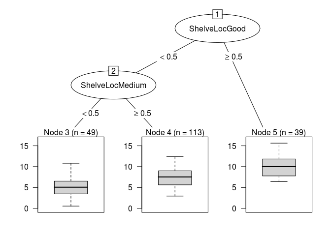

Homework 4: Bags, Forests, Boosts, oh my
================
Eric Stromgren
2/28/2019

Problem 1
---------

Problem 7 from Chapter 8 in the text. To be specific, please use a sequence of `ntree` from 25 to 500 in steps of 25 and `mtry` from 3 to 9 for by 1.

Answer 1
--------

<https://uc-r.github.io/random_forests>

``` r
set.seed(1)
df<- tbl_df(Boston)
inTraining <- createDataPartition(df$medv, p=.75, list= F)
training <- df[inTraining, ]
testing <- df[-inTraining, ]

for (t in training) {
  i = 0
  rf_boston_cv <- train(medv ~.,
                        data = training,
                        method = "rf",
                        ntree = 25 + (i  * 25),
                        importance = T,
                        tuneGrid = data.frame(mtry=3:9))
  summary(rf_boston_cv)
  i <- i + 1
  if (i == 19) {
    break}
}
```

Construct the train and test matrices
=====================================

set.seed(1234) df &lt;- tbl\_df(Boston) inTraining &lt;- createDataPartition(df$medv, p = .75, list = F) training &lt;- df\[inTraining, \] testing &lt;- df\[-inTraining, \]

tuneRF(x, y, mtryStart, ntreeTry=50, stepFactor=2, improve=0.05, trace=TRUE, plot=TRUE, doBest=FALSE, ...)

set.seed(1234) grid &lt;- expand.grid(n.trees = seq(25, 500, by = 25), n.minobsinnode = 5)

set.seed(1234) rf\_boston\_cv &lt;- train(medv ~ ., data = training, method = "rf", ntree = 100, importance = T, tuneGrid = data.frame(mtry = 3:9)) rf\_boston\_cv

bag\_boston\_25\_3 &lt;- randomForest(training, testing, mtry = 3, ntree = 25) \`\`\`

``` r
bag_boston <- randomForest(medv ~ ., data = training, mtry = 13)
bag_boston
```

    ## 
    ## Call:
    ##  randomForest(formula = medv ~ ., data = training, mtry = 13) 
    ##                Type of random forest: regression
    ##                      Number of trees: 500
    ## No. of variables tried at each split: 13
    ## 
    ##           Mean of squared residuals: 10.70519
    ##                     % Var explained: 87.86

bag\_boston\_50\_3 &lt;- randomForest(x\_training, y\_training, xtest = x\_testing, ytest = y\_testing, mtry = 3, ntree = 50) bag\_boston\_75\_3 &lt;- randomForest(x\_training, y\_training, xtest = x\_testing, ytest = y\_testing, mtry = 3, ntree = 75) bag\_boston\_100\_3 &lt;- randomForest(x\_training, y\_training, xtest = x\_testing, ytest = y\_testing, mtry = 3, ntree = 100) \# bag\_boston\_125\_3 &lt;- randomForest(x\_training, y\_training, xtest = x\_testing, ytest = y\_testing, mtry = 3, ntree = 125) \# bag\_boston\_150\_3 &lt;- randomForest(x\_training, y\_training, xtest = x\_testing, ytest = y\_testing, mtry = 3, ntree = 150) \# bag\_boston\_175\_3 &lt;- randomForest(x\_training, y\_training, xtest = x\_testing, ytest = y\_testing, mtry = 3, ntree = 175) \# bag\_boston\_200\_3 &lt;- randomForest(x\_training, y\_training, xtest = x\_testing, ytest = y\_testing, mtry = 3, ntree = 200) \# bag\_boston\_225\_3 &lt;- randomForest(x\_training, y\_training, xtest = x\_testing, ytest = y\_testing, mtry = 3, ntree = 225) \# bag\_boston\_250\_3 &lt;- randomForest(x\_training, y\_training, xtest = x\_testing, ytest = y\_testing, mtry = 3, ntree = 250) \# bag\_boston\_275\_3 &lt;- randomForest(x\_training, y\_training, xtest = x\_testing, ytest = y\_testing, mtry = 3, ntree = 275) \# bag\_boston\_300\_3 &lt;- randomForest(x\_training, y\_training, xtest = x\_testing, ytest = y\_testing, mtry = 3, ntree = 300) \# bag\_boston\_325\_3 &lt;- randomForest(x\_training, y\_training, xtest = x\_testing, ytest = y\_testing, mtry = 3, ntree = 325) \# bag\_boston\_350\_3 &lt;- randomForest(x\_training, y\_training, xtest = x\_testing, ytest = y\_testing, mtry = 3, ntree = 350) \# bag\_boston\_375\_3 &lt;- randomForest(x\_training, y\_training, xtest = x\_testing, ytest = y\_testing, mtry = 3, ntree = 375) \# bag\_boston\_400\_3 &lt;- randomForest(x\_training, y\_training, xtest = x\_testing, ytest = y\_testing, mtry = 3, ntree = 400) \# bag\_boston\_425\_3 &lt;- randomForest(x\_training, y\_training, xtest = x\_testing, ytest = y\_testing, mtry = 3, ntree = 425) \# bag\_boston\_450\_3 &lt;- randomForest(x\_training, y\_training, xtest = x\_testing, ytest = y\_testing, mtry = 3, ntree = 450) \# bag\_boston\_475\_3 &lt;- randomForest(x\_training, y\_training, xtest = x\_testing, ytest = y\_testing, mtry = 3, ntree = 475) \# bag\_boston\_500\_3 &lt;- randomForest(x\_training, y\_training, xtest = x\_testing, ytest = y\_testing, mtry = 3, ntree = 500) \# \# \# plot(1:500, rf.boston.p*t**e**s**t*mse, col = "green", type = "l", xlab = "Number of Trees", \# ylab = "Test MSE", ylim = c(10, 19)) \# lines(1:500, rf.boston.p.2*t**e**s**t*mse, col = "red", type = "l") \# lines(1:500, rf.boston.p.sq*t**e**s**t*mse, col = "blue", type = "l") \# legend("topright", c("m=p", "m=p/2", "m=sqrt(p)"), col = c("green", "red", "blue"), \# cex = 1, lty = 1) \# \# \# \# \# \# bag\_boston

\`\`\`

Problem 2
---------

Problem 8 from Chapter 8 in the text. Set your seed with 9823 and split into train/test using 50% of your data in each split. In addition to parts (a) - (e), do the following:

1.  Fit a gradient-boosted tree to the training data and report the estimated test MSE.
2.  Fit a multiple regression model to the training data and report the estimated test MSE
3.  Summarize your results.

<!-- -->

1.  

``` r
library(tree)
library(ISLR)
attach(Carseats)
set.seed(9823)
df<- tbl_df(Carseats)
inTraining <- createDataPartition(df$Sales, p=.50, list= F)
training <- df[inTraining, ]
testing <- df[-inTraining, ]
```

1.  

``` r
tree_carseats <- rpart::rpart(Sales ~ ., 
                      data = training,
                      control = rpart.control(minsplit = 20))
summary(tree_carseats)
```

    ## Call:
    ## rpart::rpart(formula = Sales ~ ., data = training, control = rpart.control(minsplit = 20))
    ##   n= 201 
    ## 
    ##            CP nsplit rel error    xerror       xstd
    ## 1  0.23155949      0 1.0000000 1.0173468 0.09708974
    ## 2  0.12226232      1 0.7684405 0.8555409 0.07828876
    ## 3  0.09172973      2 0.6461782 0.7218100 0.06677113
    ## 4  0.03533612      3 0.5544484 0.6239798 0.05599835
    ## 5  0.03433475      4 0.5191123 0.7008466 0.06537458
    ## 6  0.03003688      5 0.4847776 0.7115057 0.06797243
    ## 7  0.02823833      6 0.4547407 0.6966850 0.06851981
    ## 8  0.02671147      7 0.4265024 0.7006259 0.06910021
    ## 9  0.02151143      8 0.3997909 0.6807879 0.06912370
    ## 10 0.01799895      9 0.3782795 0.7180768 0.07159743
    ## 11 0.01200941     11 0.3422816 0.7059585 0.06945401
    ## 12 0.01033541     12 0.3302722 0.7122929 0.07028484
    ## 13 0.01000000     13 0.3199367 0.7076406 0.07023507
    ## 
    ## Variable importance
    ##   ShelveLoc       Price   CompPrice         Age  Population   Education 
    ##          41          23          11           7           5           5 
    ## Advertising      Income 
    ##           4           4 
    ## 
    ## Node number 1: 201 observations,    complexity param=0.2315595
    ##   mean=7.465721, MSE=7.428204 
    ##   left son=2 (162 obs) right son=3 (39 obs)
    ##   Primary splits:
    ##       ShelveLoc   splits as  LRL,       improve=0.23155950, (0 missing)
    ##       Price       < 129.5 to the right, improve=0.13414320, (0 missing)
    ##       Advertising < 13.5  to the left,  improve=0.09155010, (0 missing)
    ##       Age         < 61.5  to the right, improve=0.05517630, (0 missing)
    ##       US          splits as  LR,        improve=0.03545178, (0 missing)
    ## 
    ## Node number 2: 162 observations,    complexity param=0.1222623
    ##   mean=6.822222, MSE=5.749911 
    ##   left son=4 (49 obs) right son=5 (113 obs)
    ##   Primary splits:
    ##       ShelveLoc   splits as  L-R,       improve=0.19597310, (0 missing)
    ##       Price       < 105.5 to the right, improve=0.18264610, (0 missing)
    ##       Advertising < 11.5  to the left,  improve=0.07161144, (0 missing)
    ##       Age         < 63.5  to the right, improve=0.05718564, (0 missing)
    ##       Income      < 116.5 to the left,  improve=0.04340843, (0 missing)
    ##   Surrogate splits:
    ##       CompPrice  < 93.5  to the left,  agree=0.704, adj=0.02, (0 split)
    ##       Population < 14.5  to the left,  agree=0.704, adj=0.02, (0 split)
    ## 
    ## Node number 3: 39 observations,    complexity param=0.03533612
    ##   mean=10.13872, MSE=5.534591 
    ##   left son=6 (13 obs) right son=7 (26 obs)
    ##   Primary splits:
    ##       Price       < 127.5 to the right, improve=0.2444267, (0 missing)
    ##       US          splits as  LR,        improve=0.1751606, (0 missing)
    ##       Advertising < 0.5   to the left,  improve=0.1675706, (0 missing)
    ##       Education   < 11.5  to the right, improve=0.1537685, (0 missing)
    ##       Population  < 356   to the left,  improve=0.1463307, (0 missing)
    ##   Surrogate splits:
    ##       Income    < 30.5  to the left,  agree=0.744, adj=0.231, (0 split)
    ##       CompPrice < 149   to the right, agree=0.718, adj=0.154, (0 split)
    ##       Age       < 34    to the left,  agree=0.718, adj=0.154, (0 split)
    ## 
    ## Node number 4: 49 observations,    complexity param=0.03003688
    ##   mean=5.210204, MSE=4.903508 
    ##   left son=8 (35 obs) right son=9 (14 obs)
    ##   Primary splits:
    ##       Price       < 102.5 to the right, improve=0.18665160, (0 missing)
    ##       Income      < 95.5  to the left,  improve=0.18458130, (0 missing)
    ##       Education   < 11.5  to the left,  improve=0.13839380, (0 missing)
    ##       Population  < 185.5 to the left,  improve=0.12645500, (0 missing)
    ##       Advertising < 11.5  to the left,  improve=0.07818734, (0 missing)
    ##   Surrogate splits:
    ##       CompPrice  < 112.5 to the right, agree=0.816, adj=0.357, (0 split)
    ##       Age        < 75.5  to the left,  agree=0.776, adj=0.214, (0 split)
    ##       Income     < 27    to the right, agree=0.755, adj=0.143, (0 split)
    ##       Population < 496.5 to the left,  agree=0.735, adj=0.071, (0 split)
    ## 
    ## Node number 5: 113 observations,    complexity param=0.09172973
    ##   mean=7.521239, MSE=4.501483 
    ##   left son=10 (73 obs) right son=11 (40 obs)
    ##   Primary splits:
    ##       Price       < 105.5 to the right, improve=0.26925010, (0 missing)
    ##       Income      < 57.5  to the left,  improve=0.11786330, (0 missing)
    ##       Age         < 60.5  to the right, improve=0.11445890, (0 missing)
    ##       Advertising < 6.5   to the left,  improve=0.09124711, (0 missing)
    ##       CompPrice   < 115.5 to the left,  improve=0.04636677, (0 missing)
    ##   Surrogate splits:
    ##       CompPrice  < 120.5 to the right, agree=0.699, adj=0.15, (0 split)
    ##       Population < 80    to the right, agree=0.681, adj=0.10, (0 split)
    ##       Income     < 118.5 to the left,  agree=0.664, adj=0.05, (0 split)
    ## 
    ## Node number 6: 13 observations
    ##   mean=8.493846, MSE=3.219254 
    ## 
    ## Node number 7: 26 observations,    complexity param=0.02671147
    ##   mean=10.96115, MSE=4.663056 
    ##   left son=14 (17 obs) right son=15 (9 obs)
    ##   Primary splits:
    ##       Education   < 11.5  to the right, improve=0.3289528, (0 missing)
    ##       CompPrice   < 120.5 to the left,  improve=0.2320853, (0 missing)
    ##       Advertising < 0.5   to the left,  improve=0.1510274, (0 missing)
    ##       Price       < 108.5 to the right, improve=0.1324465, (0 missing)
    ##       Population  < 312.5 to the left,  improve=0.1093973, (0 missing)
    ##   Surrogate splits:
    ##       CompPrice  < 135   to the left,  agree=0.769, adj=0.333, (0 split)
    ##       Price      < 93.5  to the right, agree=0.769, adj=0.333, (0 split)
    ##       Population < 416   to the left,  agree=0.731, adj=0.222, (0 split)
    ##       Income     < 36.5  to the right, agree=0.692, adj=0.111, (0 split)
    ## 
    ## Node number 8: 35 observations,    complexity param=0.02151143
    ##   mean=4.605143, MSE=3.748665 
    ##   left son=16 (27 obs) right son=17 (8 obs)
    ##   Primary splits:
    ##       CompPrice < 137.5 to the left,  improve=0.2447961, (0 missing)
    ##       Price     < 143.5 to the right, improve=0.1786213, (0 missing)
    ##       Education < 11.5  to the left,  improve=0.1692974, (0 missing)
    ##       Age       < 44    to the right, improve=0.1435586, (0 missing)
    ##       Income    < 58.5  to the right, improve=0.1297241, (0 missing)
    ##   Surrogate splits:
    ##       Income    < 41    to the right, agree=0.8, adj=0.125, (0 split)
    ##       Education < 17.5  to the left,  agree=0.8, adj=0.125, (0 split)
    ## 
    ## Node number 9: 14 observations
    ##   mean=6.722857, MSE=4.587249 
    ## 
    ## Node number 10: 73 observations,    complexity param=0.02823833
    ##   mean=6.706301, MSE=3.290895 
    ##   left son=20 (59 obs) right son=21 (14 obs)
    ##   Primary splits:
    ##       Advertising < 13.5  to the left,  improve=0.17550200, (0 missing)
    ##       Income      < 59    to the left,  improve=0.13442920, (0 missing)
    ##       CompPrice   < 121.5 to the left,  improve=0.13058810, (0 missing)
    ##       Age         < 48.5  to the right, improve=0.12723440, (0 missing)
    ##       Price       < 136   to the right, improve=0.04860137, (0 missing)
    ## 
    ## Node number 11: 40 observations,    complexity param=0.03433475
    ##   mean=9.0085, MSE=3.286838 
    ##   left son=22 (27 obs) right son=23 (13 obs)
    ##   Primary splits:
    ##       Age         < 50.5  to the right, improve=0.3899200, (0 missing)
    ##       CompPrice   < 117.5 to the left,  improve=0.3136527, (0 missing)
    ##       Advertising < 5.5   to the left,  improve=0.1404600, (0 missing)
    ##       Income      < 55    to the left,  improve=0.1330976, (0 missing)
    ##       Price       < 96.5  to the right, improve=0.1321742, (0 missing)
    ##   Surrogate splits:
    ##       CompPrice   < 125.5 to the left,  agree=0.775, adj=0.308, (0 split)
    ##       Population  < 32    to the right, agree=0.725, adj=0.154, (0 split)
    ##       Advertising < 17.5  to the left,  agree=0.700, adj=0.077, (0 split)
    ##       Education   < 16.5  to the left,  agree=0.700, adj=0.077, (0 split)
    ## 
    ## Node number 14: 17 observations
    ##   mean=10.06, MSE=3.393306 
    ## 
    ## Node number 15: 9 observations
    ##   mean=12.66333, MSE=2.630133 
    ## 
    ## Node number 16: 27 observations,    complexity param=0.01033541
    ##   mean=4.083704, MSE=2.696394 
    ##   left son=32 (10 obs) right son=33 (17 obs)
    ##   Primary splits:
    ##       Population < 171.5 to the left,  improve=0.21196320, (0 missing)
    ##       Price      < 139.5 to the right, improve=0.18986180, (0 missing)
    ##       Education  < 11.5  to the left,  improve=0.18936010, (0 missing)
    ##       Income     < 64.5  to the right, improve=0.15477380, (0 missing)
    ##       Age        < 42.5  to the right, improve=0.09996678, (0 missing)
    ##   Surrogate splits:
    ##       Advertising < 1.5   to the left,  agree=0.778, adj=0.4, (0 split)
    ##       Price       < 149.5 to the right, agree=0.741, adj=0.3, (0 split)
    ##       Education   < 16.5  to the right, agree=0.741, adj=0.3, (0 split)
    ##       Age         < 68.5  to the right, agree=0.704, adj=0.2, (0 split)
    ## 
    ## Node number 17: 8 observations
    ##   mean=6.365, MSE=3.285325 
    ## 
    ## Node number 20: 59 observations,    complexity param=0.01799895
    ##   mean=6.336102, MSE=2.802651 
    ##   left son=40 (18 obs) right son=41 (41 obs)
    ##   Primary splits:
    ##       CompPrice   < 121.5 to the left,  improve=0.13130470, (0 missing)
    ##       Age         < 27.5  to the right, improve=0.11301050, (0 missing)
    ##       Price       < 131.5 to the right, improve=0.08968463, (0 missing)
    ##       Income      < 59    to the left,  improve=0.08736340, (0 missing)
    ##       Advertising < 6.5   to the left,  improve=0.06259425, (0 missing)
    ##   Surrogate splits:
    ##       Price      < 114.5 to the left,  agree=0.831, adj=0.444, (0 split)
    ##       Income     < 111.5 to the right, agree=0.712, adj=0.056, (0 split)
    ##       Population < 31.5  to the left,  agree=0.712, adj=0.056, (0 split)
    ##       Age        < 32    to the left,  agree=0.712, adj=0.056, (0 split)
    ## 
    ## Node number 21: 14 observations
    ##   mean=8.266429, MSE=2.336937 
    ## 
    ## Node number 22: 27 observations
    ##   mean=8.222963, MSE=2.030821 
    ## 
    ## Node number 23: 13 observations
    ##   mean=10.64, MSE=1.952092 
    ## 
    ## Node number 32: 10 observations
    ##   mean=3.098, MSE=2.886056 
    ## 
    ## Node number 33: 17 observations
    ##   mean=4.663529, MSE=1.677093 
    ## 
    ## Node number 40: 18 observations
    ##   mean=5.420556, MSE=0.8434497 
    ## 
    ## Node number 41: 41 observations,    complexity param=0.01799895
    ##   mean=6.738049, MSE=3.133225 
    ##   left son=82 (16 obs) right son=83 (25 obs)
    ##   Primary splits:
    ##       Price       < 131.5 to the right, improve=0.24937500, (0 missing)
    ##       Age         < 48.5  to the right, improve=0.14544350, (0 missing)
    ##       Income      < 59    to the left,  improve=0.12444810, (0 missing)
    ##       Advertising < 6.5   to the left,  improve=0.07810302, (0 missing)
    ##       CompPrice   < 131.5 to the right, improve=0.05041991, (0 missing)
    ##   Surrogate splits:
    ##       CompPrice  < 140   to the right, agree=0.805, adj=0.500, (0 split)
    ##       Education  < 16.5  to the right, agree=0.683, adj=0.188, (0 split)
    ##       Income     < 114.5 to the right, agree=0.659, adj=0.125, (0 split)
    ##       Population < 437   to the right, agree=0.659, adj=0.125, (0 split)
    ## 
    ## Node number 82: 16 observations
    ##   mean=5.633125, MSE=2.359334 
    ## 
    ## Node number 83: 25 observations,    complexity param=0.01200941
    ##   mean=7.4452, MSE=2.347105 
    ##   left son=166 (7 obs) right son=167 (18 obs)
    ##   Primary splits:
    ##       Age         < 68    to the right, improve=0.30558290, (0 missing)
    ##       Advertising < 6     to the left,  improve=0.28734230, (0 missing)
    ##       Urban       splits as  LR,        improve=0.18450460, (0 missing)
    ##       Income      < 87.5  to the right, improve=0.10393110, (0 missing)
    ##       Price       < 121.5 to the right, improve=0.08411169, (0 missing)
    ##   Surrogate splits:
    ##       Income      < 101   to the right, agree=0.84, adj=0.429, (0 split)
    ##       Advertising < 1     to the left,  agree=0.80, adj=0.286, (0 split)
    ##       Population  < 384.5 to the right, agree=0.76, adj=0.143, (0 split)
    ## 
    ## Node number 166: 7 observations
    ##   mean=6.087143, MSE=0.8713061 
    ## 
    ## Node number 167: 18 observations
    ##   mean=7.973333, MSE=1.924867

``` r
prp(tree_carseats)
```


``` r
plot(as.party(tree_carseats))
```


``` r
pred_carseats = predict(tree_carseats, testing)
mean((testing$Sales - pred_carseats)^2)
```

    ## [1] 4.484515

The Test MSE is 4.48

1.  

``` r
fit_control <- trainControl(method = "repeatedcv",
                            number = 10, 
                            repeats = 10)
cv_tree_carseats <- train(Sales ~ ., 
                          data = training,
                          method = "rpart", 
                          trControl = fit_control)
```

    ## Warning in nominalTrainWorkflow(x = x, y = y, wts = weights, info =
    ## trainInfo, : There were missing values in resampled performance measures.

``` r
plot(cv_tree_carseats)
```



``` r
plot(as.party(cv_tree_carseats$finalModel))
```


``` r
pred_carseats_1 = predict(cv_tree_carseats, testing)
mean((testing$Sales - pred_carseats_1)^2)
```

    ## [1] 6.170433

Pruning increases the test MSE to 4.99

1.  

``` r
bag_carseats <- randomForest(Sales ~ ., data = training, mtry = 10)
bag_carseats
```

    ## 
    ## Call:
    ##  randomForest(formula = Sales ~ ., data = training, mtry = 10) 
    ##                Type of random forest: regression
    ##                      Number of trees: 500
    ## No. of variables tried at each split: 10
    ## 
    ##           Mean of squared residuals: 2.826847
    ##                     % Var explained: 61.94

``` r
test_preds <- predict(bag_carseats, newdata = testing)
carseats_test_df <- testing %>%
  mutate(y_hat_bags = test_preds,
         sq_err_bags = (y_hat_bags - Sales)^2)
mean(carseats_test_df$sq_err_bags)
```

    ## [1] 3.064914

The test error rate on the bagging approach is 3.06. Nice reduction.

``` r
importance(bag_carseats)
```

    ##             IncNodePurity
    ## CompPrice       142.12601
    ## Income          121.43883
    ## Advertising     113.78931
    ## Population       49.38153
    ## Price           337.48808
    ## ShelveLoc       510.96163
    ## Age             105.26429
    ## Education        53.80762
    ## Urban             6.32532
    ## US               16.64603

ShelveLoc, Price and CompPrice are the most important predictors of Sales.

1.
